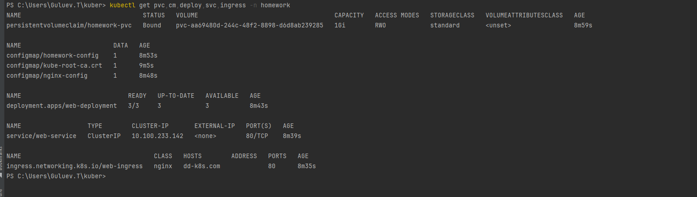

само дз


разобрался
не хватало конфига для nginx

итоговый результат:


как запускать этого шайтана:
1) установим у метку ```kubectl apply -f .\homework/1/manifests/namespace.yaml```
2) длаее последовательно применяем :

```
kubectl apply -f  .\homework\2\manifests\pvc.yaml
kubectl apply -f  .\homework\2\manifests\cm.yaml
kubectl apply -f  .\homework\2\manifests\nginx-config.yaml
kubectl apply -f  .\homework\2\manifests\deployment.yaml
kubectl apply -f  .\homework\2\manifests\service.yaml
kubectl apply -f  .\homework\2\manifests\ingress.yaml
```



такой вывод это значит шо все четко , молодцом и все готов к работе. 