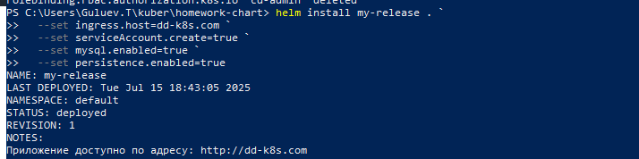
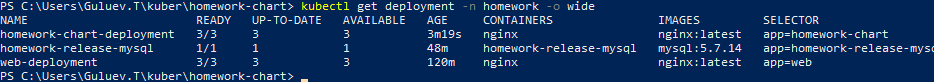

само задание 

теперь выполняем:
для начала : запусти все с предыдущего дз (ибо тут модификации по deployment есть)

``` 
kubectl apply -f monitoring-sa.yaml -f monitoring-role.yaml  
```

далее :
```
kubectl apply -f deployment.yaml
```

далее:

```
kubectl apply -f cd-sa.yaml -f cd-rolebinding.yaml
```
получаем токен:

```
kubectl create token cd --namespace homework --duration 24h > token
```

далее чтобы было круто и удобно выполняем(на винде):
```
 Получаем адрес API-сервера
$CLUSTER_NAME = kubectl config view -o jsonpath='{.clusters[0].name}'
```

```
# Получаем имя секрета для ServiceAccount `cd`
$CLUSTER_CA = kubectl config view --raw -o jsonpath='{.clusters[0].cluster.certificate-authority-data}'
```

```
 Если certificate-authority-data пуст, попробуем другой способ
if ([string]::IsNullOrEmpty($CLUSTER_CA)) {
    $CLUSTER_CA = kubectl get secret $(kubectl get sa cd -n homework -o jsonpath='{.secrets[0].name}') -n homework -o jsonpath='{.data.ca\.crt}'
}
```

```
$SERVER = kubectl config view --minify -o jsonpath='{.clusters[0].cluster.server}'
```
```
$TOKEN = Get-Content -Path .\homework\3\token

```

далее пихаем в файл:
```
@"
apiVersion: v1
kind: Config
clusters:
- name: minikube
  cluster:
    insecure-skip-tls-verify: true  # Временное решение для тестов
    server: $SERVER
users:
- name: cd
  user:
    token: $TOKEN
contexts:
- name: cd-context
  context:
    cluster: minikube
    user: cd
    namespace: homework
current-context: cd-context
"@ | Out-File -FilePath .\homework\3\cd-kubeconfig.yaml -Encoding utf8
```
файл cd-kubeconfig.yaml ? норм : стрем. Переделай

теперь если напишем :
```
kubectl --kubeconfig=.\homework\3\manifests\cd-kubeconfig.yaml get pods -n homework

```
увидим красоту 


Создание хелма:
```
helm create homework-chart //создадим
Remove-Item -Recurse -Force templates\*//кдалим сожержимо tmp

```
далее создаем файлы шаблонов:
```
New-Item -ItemType File templates\deployment.yaml
New-Item -ItemType File templates\service.yaml
New-Item -ItemType File templates\ingress.yaml
New-Item -ItemType File templates\configmap.yaml
New-Item -ItemType File templates\pvc.yaml
```

заполняем их содержимое +- динамически.

Немного пошаманив получаем то что в файлах

далее редачим values.yaml:
```
replicaCount: 3
image:
  repository: nginx
  tag: latest
service:
  type: ClusterIP
  port: 80
ingress:
  enabled: true
  className: nginx
  host: dd-k8s.com
config:
  data:
    key1: value1
    key2: value2
    key3: value3
nginxConfig: |
  server {
    listen 80;
  
    location /conf/file {
      alias /homework/conf/file;
      default_type text/plain;
    }

    location / {
      root /usr/share/nginx/html;
    }
  }
nodeSelector:
  homework: "true"
serviceAccount:
  create: true
  name: monitoring
mysql:
  enabled: false
persistence:
  size: 1Gi  # Добавляем значение по умолчанию
```

Реадктируем Char.yaml:
```
apiVersion: v2
name: homework-chart
description: A Helm chart for homework application
version: 0.1.0
dependencies:
  - name: mysql
    version: "9.14.*"
    repository: "https://charts.bitnami.com/bitnami"
```
по идее передав параметры мы запустимся, попытка номер 4 (до этого запущенные рукой манифесты, не давали собраться.удалил их)

```
> helm install my-release . `
>>   --set ingress.host=dd-k8s.com `
>>   --set serviceAccount.create=true `
>>   --set mysql.enabled=true `
>>   --set persistence.enabled=true

```
воттехелл запустилось



получается что teamplates - по сути те же манифесты но настраиваемые динамически.. круто

